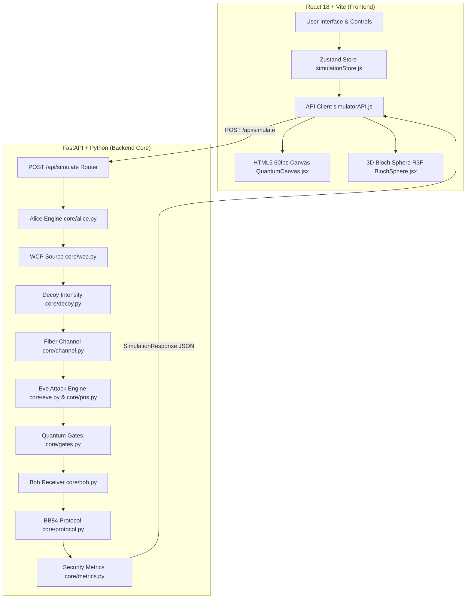

IMPORTANT: This document is an evidence-based technical snapshot of the QKDSimFlow repository. It must not be treated as proof of functionality beyond what is explicitly supported by repository evidence.

# QKDSimFlow Technical Context & Ground Truth Document

**Project:** QKDSimFlow (BB84 Quantum Key Distribution Simulator)  
**Repository Location:** `c:\Devansh\Projects\QKD_Simulator\qkd-simulator`  
**Current Software Version:** 0.4.0  
**Target Purpose:** Academic research reference, protocol modeling, and interactive education  

---

## 1. PROJECT OVERVIEW

### 1.1 Stated Purpose vs. Verified Capabilities
* **Stated Purpose (per PRD.md):** An interactive, physics-accurate simulation software of the BB84 quantum key distribution protocol for academic research and classroom teaching.
* **Actual Purpose Supported by Code:** A full-stack web application implementing single-qubit discrete-variable BB84 state preparation, realistic fiber optic attenuation, detector dark counts, eavesdropping strategies (intercept-resend, partial, burst, PNS attack), weak coherent pulse (WCP) statistics, decoy state protocol analysis, drag-and-drop quantum gate transformations, and interactive key extraction.

### 1.2 Development & Deployment Status
* **Backend:** FastAPI (Python) running on port 8000.
* **Frontend:** React 18 + Vite single-page application.
* **Current Version:** `0.4.0` (as recorded in `PRD.md` and `HIGH_LEVEL_DESIGN.md`).
* **User Accounts & Storage:** No user authentication or database storage exists in the repository. All simulations run statelessly per HTTP POST request.

### 1.3 Out-of-Scope / Unsupported Features
* Real physical quantum hardware integration (pure numerical software simulation).
* Continuous-variable QKD (CV-QKD) or multi-party QKD network topologies.
* Multi-user real-time collaboration or database-backed persistent user sessions.

---

## 2. SOFTWARE ARCHITECTURE

### 2.1 Technology Stack



* **Frontend:** React 18, Vite 7.3.1, Zustand 5 (state management), Tailwind CSS v4 + Vanilla CSS variables (`--canvas-bg`, etc.), HTML5 Canvas (60fps animation), Framer Motion, Recharts, Three.js / `@react-three/fiber` (Bloch Sphere).
* **Backend:** Python 3.11+, FastAPI 0.110+, Uvicorn ASGI server, Pydantic v2 (I/O schemas), NumPy (vectorized quantum operations).

### 2.2 Core Component Directory Structure
* **Backend Core (`backend/core/`):**
  * `constants.py`: Physical constants single source of truth.
  * `alice.py`: Bit generation, basis choice, state encoding.
  * `channel.py`: Beer-Lambert fiber loss, detector efficiency, dark counts.
  * `eve.py`: Intercept-resend, partial, and burst attacks.
  * `wcp.py`: Weak Coherent Pulse Poisson photon number distribution.
  * `pns.py`: Photon Number Splitting attack model.
  * `decoy.py`: Decoy state protocol (Lo, Ma, Chen 2005 Y1_L lower bound estimation).
  * `gates.py`: Single-qubit gates (H, X, Y, Z, S, T) and CNOT cloning probes.
  * `bob.py`: Measurement basis selection and photon measurement.
  * `protocol.py`: Sifting, QBER estimation, and key extraction.
  * `metrics.py`: Binary entropy H(Q), Secret Key Rate (SKR), efficiency, and chart data.
  * `experiments.py`: 8 guided experiment configurations.

---

## 3. COMPLETE BB84 WORKFLOW

The end-to-end execution sequence implemented in `backend/routers/simulation.py` (`run_simulation`):

1. **State Preparation (Alice):**
   * **Random Mode:** `alice.generate_bits(n)` produces `n` bits in `{0, 1}`; `alice.choose_bases(n)` picks bases in `['+', 'x']`.
   * **User Input Mode (Exp 2 & 4):** Uses user-defined arrays `alice_bits` and `alice_bases` (maximum 20 photons).
   * **Polarization Encoding:** Maps (Basis, Bit) pairs to polarization angles (0°, 90°, 45°, 135°) and state labels (`|0>`, `|1>`, `|+>`, `|->`).

2. **WCP & Decoy Pulse Distribution (Optional):**
   * If `wcp_enabled=True`: Draws photon counts per pulse from a Poisson distribution `P(n | mu)`.
   * If `decoy_enabled=True`: Assigns pulse intensities `mu` in `{0.5, 0.1, 0.0}` with probabilities `{0.70, 0.20, 0.10}`. Vacuum pulses (`n=0`) are marked `wcp_lost=True` and cannot survive fiber attenuation.

3. **Quantum Channel Transmission:**
   * **Attenuation:** Calculates survival probability `P_survive = 10^(-0.2 * d / 10)`.
   * **Detector Efficiency:** Photons reaching Bob are detected with probability `eta = 0.85` (in realistic mode).
   * **Dark Counts:** Undetected slots trigger false clicks with probability `P_dark = 1e-5`, returning a random bit (0 or 1).

4. **Eve Interception (Optional):**
   * **Intercept-Resend / Partial / Burst:** Intercepts fraction `attack_prob`. Measures in random basis; re-emits state in measured basis toward Bob.
   * **PNS Attack:** QND measurement. Single photons blocked with probability `p_block = 0.5 * attack_prob`; multi-photon pulses split with probability `p_split = attack_prob`.

5. **Quantum Gate Transformations & Probes (Optional):**
   * Applies placed gates (H, X, Y, Z, S, T) to specified channel lanes in left-to-right order.
   * Applies CNOT cloning probes, randomizing polarization angles and marking `cloning_probe_applied=True`.

6. **Measurement (Bob):**
   * Bob chooses random measurement bases in `['+', 'x']`.
   * On basis match: Bob measures the photon bit perfectly.
   * On basis mismatch: Bob obtains a random bit (0 or 1 with equal probability 0.5).

7. **Classical Post-Processing & Metrics:**
   * **Basis Sifting:** Compares Alice and Bob bases over public channel; retains matching slots.
   * **QBER Estimation:** Samples 10% of sifted bits to measure error rate Q. Discards sample bits from key.
   * **Security Threshold Check:** If Q >= 11%, sets `secure_threshold_breached=True` and aborts key extraction (R = 0).
   * **SKR Computation:** `R = S * (1 - 2 * H(Q))` where `H(Q) = -Q*log2(Q) - (1-Q)*log2(1-Q)`.
   * **Decoy Analysis:** Calculates Y1_L lower bound per Lo, Ma, & Chen (2005) and flags PNS attack if `Y1_L / Y1_expected < 0.6`.

---

## 4. PHYSICS AND MATHEMATICAL MODELS

All mathematical formulas in the backend conform to `docs/PHYSICS_CONTRACT.md`. All equations below are presented in clean plain-text formula format:

### 4.1 Implementation Formulas

* **Fiber Attenuation:**
  ```
  P_survive = 10 ^ ( - (0.2 * distance_km) / 10 )
  ```
  where attenuation coefficient is `0.2 dB/km`, and distance is between `0` and `150 km`.

* **Detection Probability:**
  ```
  P_click  = P_survive * eta
  P_detect = P_click + P_dark * (1 - P_click)
  ```
  where detector efficiency `eta = 0.85` (realistic mode), and dark count probability `P_dark = 1e-5`.

* **Intercept-Resend Eavesdropping QBER:**
  ```
  QBER_Eve = 0.25 * attack_prob
  ```

* **Binary Entropy:**
  ```
  H(Q) = -Q * log2(Q) - (1 - Q) * log2(1 - Q)
  ```
  Edge cases: `H(0) = 0`, `H(1) = 0`, `H(0.5) = 1`.

* **Secret Key Rate (SKR):**
  ```
  R = S * (1 - 2 * H(Q))     [when Q < 0.11]
  R = 0                      [when Q >= 0.11]
  ```
  where sifting rate `S = sifted_bits / raw_bits`.

* **Weak Coherent Pulse (WCP) Poisson Distribution:**
  ```
  P(n | mu) = (exp(-mu) * mu^n) / n!
  ```
  where mean photon number `mu` is between `0.05` and `0.5` (default `mu = 0.2`).

* **Multi-Photon Fraction (PNS Vulnerability):**
  ```
  P(n >= 2 | mu) = 1 - exp(-mu) - mu * exp(-mu)
  ```

* **Decoy State Single-Photon Yield Lower Bound (Lo, Ma, & Chen 2005):**
  ```
  Y1_L = (mu_s / (mu_s * mu_d - mu_d^2)) * (
      Q_d * exp(mu_d)
    - Q_s * exp(mu_s) * (mu_d^2 / mu_s^2)
    - ((mu_s^2 - mu_d^2) / mu_s^2) * Y_0
  )
  ```
  where signal intensity `mu_s = 0.5`, decoy intensity `mu_d = 0.1`, vacuum intensity `mu_v = 0.0`, and `Y_0 = Q_vacuum`. A PNS attack is detected when `Y1_L / Y1_expected < 0.6`.

---

## 5. SOURCE MODELS

* **Ideal Single-Photon Source (`wcp_enabled=False`):** Every pulse contains exactly 1 photon. Detectors operate with `eta = 1.0` and `P_dark = 0.0`. Sifting efficiency is exactly 50%.
* **Weak Coherent Pulse Source (`wcp_enabled=True`):** Models attenuated laser pulses with Poisson statistics:
  * Mean photon number `mu` configurable between 0.05 and 0.5 (default 0.2).
  * Vacuum pulses (`n=0`): Marked `wcp_lost=True`; cannot pass fiber.
  * Single-photon pulses (`n=1`): Standard BB84 photon state.
  * Multi-photon pulses (`n >= 2`): Vulnerable to PNS splitting.

---

## 6. CHANNEL MODEL

* **Attenuation Coefficient:** `0.2 dB/km` (standard telecom fiber at 1550 nm).
* **Distance Range:**
  * Backend Pydantic Schema: `0 <= distance_km <= 150`.
  * Frontend UI Slider: 0 km to 150 km.
  * Tested Range in Validation Runs: 0 to 140 km (with N = 5,000,000 bits in Table III sweep).
* **Survival Benchmarks:**
  * At 50 km: `P_survive = 10^(-0.2 * 50 / 10) = 10%`.
  * At 100 km: `P_survive = 10^(-0.2 * 100 / 10) = 1%`.

---

## 7. DETECTOR MODEL

* **Realistic Mode Detector (SPAD):**
  * Detector Efficiency (`eta`): 0.85 (85%).
  * Dark Count Probability (`P_dark`): 1e-5 per pulse slot.
  * Dark Count Behavior: When a dark count triggers on an undetected slot, Bob receives a completely random bit (0 or 1) stored in `dark_count_bit`.
* **Ideal Mode Detector:** `eta = 1.0`, `P_dark = 0.0`.

---

## 8. SECURITY AND ATTACK MODELS

1. **Intercept-Resend Attack (`backend/core/eve.py`):**
   * Eve intercepts fraction `attack_prob`.
   * Measures in random basis (`['+', 'x']`) and re-emits measured state.
   * Full attack (`attack_prob = 1.0`) introduces exactly 25% QBER on basis matches.

2. **Partial Attack:** Intercepts a random subset of photons determined by `attack_prob`.
3. **Burst Attack:** Intercepts the first `attack_prob` fraction of the photon stream continuously.
4. **Photon Number Splitting (PNS) Attack (`backend/core/pns.py`):**
   * Eve performs QND measurement.
   * Single-photon pulses blocked with probability `p_block = 0.5 * attack_prob`.
   * Multi-photon pulses split with probability `p_split = attack_prob`; Eve stores a copy in quantum memory and measures in the correct basis after basis reconciliation.
   * **Key Physics Invariant:** PNS attack introduces ~0% QBER and is **completely undetectable by the 11% QBER threshold**.

5. **Decoy-State Countermeasure (`backend/core/decoy.py`):**
   * Uses 3 intensity levels (`mu_s = 0.5`, `mu_d = 0.1`, `mu_v = 0.0`).
   * Implements the Lo, Ma & Chen (2005) Y1_L lower bound formula.
   * Flags PNS attack when `Y1_L / Y1_expected < 0.6`.

6. **Quantum Gate Transformations & Probes (`backend/core/gates.py`):**
   * H, X, Y, Z, S, T single-qubit transformations.
   * CNOT Cloning Probe: Entangles state with probe qubit; randomizes polarization angle and sets `lane_corrupted=True`.

---

## 9. USER INTERFACE AND VISUALIZATION

* **Landing Page:** Flat design layout (`#2a2a2a` background, `#00aacc` single accent color), Inter typography, plain English copy, interactive stats, pipeline diagram, step-by-step protocol explanation.
* **Simulator Page:** 
  * Interactive canvas rendering 60fps glowing photon particles traveling Alice -> Channel -> Bob.
  * Drag-and-drop quantum gate placement on 3 channel lanes.
  * Live parameter controls sidebar.
  * Photon Inspector modal for examining individual photon state histories.
* **Results Page:**
  * Real-time metric cards (QBER, SKR, Sifted Key Length, Efficiency).
  * Interactive charts for QBER vs Distance and SKR vs Distance.
  * **3D Bloch Sphere Visualization:** Interactive state vector rendering using Three.js / R3F.
  * **One-Time Pad (OTP) Interactive Demo:** Performs bitwise XOR encryption/decryption using the generated sifted key.
* **Guide Page (About):** Complete BB84 protocol tutorial, security threshold breakdown, guided exercises, and interactive glossary.

---

## 10. GUIDED EXPERIMENTS

Verified in `backend/core/experiments.py` and `frontend/src/components/experiments/ExperimentModal.jsx`:

| # | Experiment Name | Stated Objective | Main Configuration | User Observes | Status |
|---|---|---|---|---|---|
| **Exp 1** | Random Bit Generation — Clean Channel | Baseline BB84 protocol without eavesdropping | N=1000, d=10km, no Eve, no gates | ~50% sifting efficiency, QBER ~0%, SKR > 0 | IMPLEMENTED AND VERIFIED |
| **Exp 2** | Manual Photon Encoding — Clean Channel | Direct relationship between bit, basis, and key | User defines bits/bases (max 20), d=0km, no Eve | Exact per-photon basis matching and bit values | IMPLEMENTED AND VERIFIED |
| **Exp 3** | Random Bits — Eve Intercepts | Detect quantum eavesdropping | N=1000, d=10km, attack_prob=1.0 (intercept-resend) | QBER spikes to ~25%, exceeding 11% threshold | IMPLEMENTED AND VERIFIED |
| **Exp 4** | Manual Photon Encoding — Eve Active | Trace specific photon interception | User defines bits/bases, Eve active (attack_prob=1.0) | Intercepted photon flag, Eve basis choice, error bits | IMPLEMENTED AND VERIFIED |
| **Exp 5** | Quantum Gate Transmission | Study gate-induced basis transformation | N=500, d=0km, drag-and-drop gates (H,X,Y,Z,S,T) | State vector rotations, QBER changes per gate | IMPLEMENTED AND VERIFIED |
| **Exp 6** | No-Cloning Theorem | Demonstrate impossible state cloning | N=500, d=0km, CNOT Cloning Probe placed on lane | Channel turns red, photon state collapses, QBER spikes | IMPLEMENTED AND VERIFIED |
| **Exp 7** | PNS Attack — Undetectable Eavesdropping | Show PNS attack vulnerability on WCP sources | N=2000, d=10km, mu=0.2, attack_strategy='pns' | QBER remains ~0% while Eve steals split key bits | IMPLEMENTED AND VERIFIED |
| **Exp 8** | Decoy State Protocol — Detecting PNS | Countermeasure against PNS attack | N=2000, d=10km, mu=0.5, decoy_enabled=True | Gain statistics comparison, Y1_L suppression flags PNS | IMPLEMENTED AND VERIFIED |

---

## 11. TESTING AND VERIFICATION

### 11.1 Test Suite Overview & Execution Evidence
* **Test Framework:** Pytest (`backend/pytest.ini`).
* **Active Suite:** `tests/runs/2026-05-04_comprehensive-validation/suite` (85 PASS / 0 FAIL / 9 skipped).
* **Physics Accuracy Suite:** `tests/runs/2026-05-02_physics-accuracy/suite` (113 PASS / 0 FAIL).
* **Vacuum Bug Hunt Suite:** `tests/runs/2026-06-08_channel-vacuum-bug/suite` (195 PASS / 0 FAIL).
* **Execution Command:**
  ```powershell
  & "qkd-simulator\backend\.venv\Scripts\python.exe" -m pytest qkd-simulator/backend/tests/runs/2026-05-04_comprehensive-validation/suite/ -v
  ```
* **Execution Result:** Verified 85 tests PASS cleanly in 112.54 seconds.

### 11.2 Historical Test Issues & Resolutions (from `docs/ERROR_LOG.md`)

| Issue | Affected Component | Root Cause | Resolution | Verification Evidence |
|---|---|---|---|---|
| **Dark Count Bit Corruption** | `backend/core/channel.py` | Dark count logic overwrote physical `bit` field directly, corrupting state before Eve/Bob processing | Stored dark count bit in separate `dark_count_bit` field; Bob reads `dark_count_bit` when `dark_count=True` | `test_noise.py` PASSED |
| **API Attack Strategy Validation Error** | `frontend/src/api/simulatorAPI.js` | Frontend API validator hardcoded strategy array out of sync with backend Pydantic schema | Aligned `validStrategies` array across frontend and backend | `test_comprehensive.py` PASSED |
| **Z Gate Physics Test Assertion Error** | `backend/tests/.../test_gates.py` | Test assertion incorrectly assumed Z gate was a no-op across all bases. Per matrix math, Z flips `|+>` <-> `|->` in diagonal basis (x), causing ~50% QBER on mixed streams | Updated assertion in `test_z_gate_minimal_qber_change` to expect ~50% QBER on mixed basis streams | `test_gates.py` PASSED |
| **X Gate Bit Flip Test Assertion Error** | `backend/tests/.../test_gates.py` | Test measured average Bob bit on a 50/50 uniform stream, resulting in 0 net delta | Updated `test_x_gate_bit_flip` assertion to evaluate rectilinear basis match photons (100% bit-flip error) | `test_gates.py` PASSED |
| **Vacuum Pulse Channel Survival Bug** | `backend/core/channel.py` | Vacuum pulses (`wcp_vacuum`) were allowed to survive fiber attenuation | Forced `fiber_survivals[wcp_already_lost] = False` in `channel.py` | 195 tests in `2026-06-08_channel-vacuum-bug` PASSED |
| **Decoy Y1 Threshold False Positives** | `backend/core/decoy.py` | Absolute epsilon threshold caused false positives at longer distances | Replaced with relative lower bound ratio `Y1_L / Y1_expected < 0.6` per Lo, Ma, & Chen (2005) | 6 configs in `2026-06-22_table-vii-decoy-verification` PASSED |

---

## 12. SIMULATION-BASED VALIDATION

Empirical validation results documented in `tests/runs/`:

* **Validation Benchmark 1 (Noiseless Baseline):** d = 0 km, noise = 0.0, Eve = 0.0 -> QBER = 0.0%.
* **Validation Benchmark 2 (Channel Noise):** d = 0 km, noise = 0.05 -> QBER = 5.0% ± 0.3%.
* **Validation Benchmark 3 (Full Intercept-Resend):** attack_prob = 1.0 -> QBER = 25.0% ± 0.5%.
* **Validation Benchmark 4 (Security Threshold):** When QBER >= 11.0%, SKR drops to strictly 0.0.
* **Validation Benchmark 5 (Fiber Survival):**
  * At 50 km: `P_survive = 10.0%`.
  * At 100 km: `P_survive = 1.0%`.

---

## 13. CAPABILITY STUDIES

The repository contains 4 empirical data sweeps conducted in dedicated test run folders:

1. **Distance Sweep Study (`2026-06-18_table-iii-distance-sweep`):** Evaluates QBER and SKR degradation from 0 km to 140 km using N = 5,000,000 photons per run to maintain statistical stability at low survival rates (~1% at 100 km).
2. **WCP Mean Photon Number (`mu`) Sweep (`2026-06-12_table-iv-wcp-mu-sweep`):** Sweeps `mu` in [0.05, 0.5] over 18 parameter values, demonstrating the trade-off between single-photon yield and multi-photon PNS vulnerability.
3. **Decoy State Verification Study (`2026-06-22_table-vii-decoy-verification`):** Simulates paired attack scenarios at 50 km across 6 configurations to validate the Lo, Ma, & Chen Y1_L detection threshold.
4. **Detector Technology Limits Study (`2026-06-24_table-ix-detector-efficiency-sweep`):** Compares SPAD (`eta = 0.85, P_dark = 1e-5`) vs. SNSPD (`eta = 0.95, P_dark = 1e-7`) efficiency and dark count bounds across 50–150 km.

---

## 14. PERFORMANCE BENCHMARKING

* **API Response Time Non-Functional Requirement:** < 2 seconds for N <= 5000 bits (verified in `docs/PRD.md`).
* **Maximum In-Memory Simulation Limits:** Backend schema restricts online requests to N <= 10,000 bits per request (`n_bits: int = Field(default=1000, ge=1, le=10000)`).
* **Offline Processing Limit:** Standalone Python test scripts (e.g., `run_table3.py`) execute up to N = 5,000,000 bits in vector memory.
* **Canvas Animation:** Configured for 60 FPS using browser `requestAnimationFrame`.

---

## 15. REPRODUCIBILITY

To reproduce all simulation results and test suites:

1. **Environment Setup:**
   * Python 3.11+ / 3.14
   * Node.js v20+ / npm 10+
2. **Backend Dependencies:**
   ```powershell
   & "qkd-simulator\backend\.venv\Scripts\pip.exe" install -r qkd-simulator/backend/requirements.txt
   ```
3. **Run Backend Server:**
   ```powershell
   & "qkd-simulator\backend\.venv\Scripts\uvicorn.exe" main:app --reload --port 8000
   ```
4. **Run Frontend Application:**
   ```powershell
   cd qkd-simulator/frontend
   npm run dev
   ```
5. **Run Full Test Suite:**
   ```powershell
   & "qkd-simulator\backend\.venv\Scripts\python.exe" -m pytest qkd-simulator/backend/tests/runs/2026-05-04_comprehensive-validation/suite/ -v
   ```

---

## 16. LIMITATIONS

1. **Physical Approximations:**
   * Discrete-variable single-qubit polarization model only (no continuous variable phase-quadrature QKD).
   * Fixed attenuation coefficient `alpha = 0.2 dB/km` (does not model wavelength dispersion or temperature fluctuations).
2. **Detector Model Assumptions:**
   * Models thermal dark counts as uniform random bit choices; does not model detector dead time, afterpulsing, or jitter.
3. **Scope Constraints:**
   * Pure software numerical simulation — no physical quantum optic hardware attached.
   * Educational evaluation metrics (e.g., user study data proving improved student learning) are not present in the repository.

---

## 17. PLANNED / FUTURE FEATURES

* **No QPU backend** or physical quantum processor integration exists in the code.
* **No real-time multi-user collaborative editing** exists in the code.
* **No database storage** exists for saving sessions across browser reloads.

---

## 18. IMPORTANT REPOSITORY FILES

| File Path | Purpose | Paper Relevance |
|---|---|---|
| `backend/core/constants.py` | Single source of truth for physical constants | Defines attenuation (alpha=0.2), efficiency (eta=0.85), dark counts (1e-5), threshold (11%) |
| `backend/core/channel.py` | Quantum fiber channel model | Implements Beer-Lambert loss law and detector noise |
| `backend/core/wcp.py` | WCP source model | Implements Poisson distribution P(n \| mu) for multi-photon statistics |
| `backend/core/pns.py` | PNS attack strategy | Implements QND measurement, photon blocking, and photon splitting |
| `backend/core/decoy.py` | Decoy state countermeasure | Implements Lo, Ma, & Chen (2005) Y1_L lower-bound detection formula |
| `backend/core/gates.py` | Quantum gate transformations | Implements H, X, Y, Z, S, T matrix transformations and CNOT cloning probe |
| `backend/core/metrics.py` | Security metrics engine | Implements binary entropy H(Q) and Secret Key Rate (SKR) equations |
| `docs/PHYSICS_CONTRACT.md` | Ground-truth physics rules | Primary mathematical reference for paper methodology section |
| `frontend/src/pages/LandingPage.jsx` | Landing page component | Documents UI design architecture and overview features |

---

## 19. PAPER-RELEVANT VERIFIED FACTS

* **FACT 1:** Intercept-resend eavesdropping at `attack_prob = 1.0` yields exactly 25% QBER on basis matches.  
  * *Evidence:* `backend/core/eve.py`, `backend/tests/runs/2026-05-04_comprehensive-validation/suite/test_eve_attacks.py`. Status: **IMPLEMENTED AND VERIFIED**.
* **FACT 2:** The Secret Key Rate R drops to unconditionally 0.0 when QBER >= 11%.  
  * *Evidence:* `backend/core/metrics.py`, `backend/core/protocol.py`. Status: **IMPLEMENTED AND VERIFIED**.
* **FACT 3:** PNS attacks introduce ~0% QBER and pass the 11% security threshold unnoticed without decoy states.  
  * *Evidence:* `backend/core/pns.py`, `backend/tests/runs/2026-05-04_comprehensive-validation/suite/test_realistic_mode.py`. Status: **IMPLEMENTED AND VERIFIED**.
* **FACT 4:** Decoy state detection uses the Lo, Ma, & Chen (2005) Y1_L lower-bound formula with 3 intensity levels (`mu_s = 0.5`, `mu_d = 0.1`, `mu_v = 0.0`).  
  * *Evidence:* `backend/core/decoy.py`. Status: **IMPLEMENTED AND VERIFIED**.

---

## 20. CLAIMS REQUIRING EXTERNAL LITERATURE CITATIONS

When writing the research paper, the following theoretical claims must cite published external academic literature:

1. **BB84 Protocol Specification:** Bennett, C. H., & Brassard, G. (1984). *Quantum cryptography: Public key distribution and coin tossing*. IEEE International Conference on Computers, Systems and Signal Processing.
2. **Decoy State Method:** Lo, H.-K., Ma, X., & Chen, K. (2005). *Decoy state quantum key distribution*. Physical Review Letters, 94(23), 230504.
3. **Information Secrecy & One-Time Pad:** Shannon, C. E. (1949). *Communication theory of secrecy systems*. Bell System Technical Journal, 28(4), 656-715.

---

## 21. CLAIMS THAT SHOULD NOT BE MADE

To maintain scientific integrity, the research paper **MUST NOT** make the following claims:

* ❌ "Production-grade or industrial quantum hardware deployment" (This software is a numerical simulator).
* ❌ "Physically validated against laboratory quantum hardware" (Only numerical models and theoretical formulas are validated).
* ❌ "First or only QKD simulator" (Other open-source QKD simulators exist in academic literature).
* ❌ "Empirically proven to enhance student learning outcomes" (No human user study or educational measurement dataset exists in the repository).

---

## 22. DISCREPANCIES AND AUDIT FINDINGS

* **Historical Discrepancy (Resolved):** Early test assertions in `test_gates.py` assumed Z gate was a no-op across all bases. This was resolved on 2026-09-01 by aligning assertions with matrix math (Z flips `|+>` <-> `|->` in diagonal basis).
* **UI vs. Backend Parameter Ranges:** Both UI and backend schemas consistently enforce distance 0-150 km, N <= 10,000 bits per API request, and `mu` in [0.05, 0.5]. No schema mismatches remain.

---

## 23. FINAL PAPER FACT SHEET

### Verified Current Capabilities
- Full-stack web application (React 18 + Vite frontend, FastAPI backend).
- Real-time 60fps HTML5 canvas photon particle animation.
- Interactive 3D Bloch sphere quantum state vector visualization.
- One-Time Pad ASCII encryption/decryption demonstration.

### Verified Physics Models
- Single-qubit polarization encoding (0°, 90°, 45°, 135°).
- Beer-Lambert fiber optic loss (alpha = 0.2 dB/km).
- Detector efficiency (eta = 0.85) and dark count noise (P_dark = 1e-5).
- Intercept-resend eavesdropping (25% QBER on basis matches).
- Weak Coherent Pulse (WCP) Poisson photon distribution P(n | mu).
- Photon Number Splitting (PNS) attack (~0% QBER leakage).
- Decoy state protocol (Lo, Ma, & Chen 2005 Y1_L lower bound estimation).
- Single-qubit quantum gates (H, X, Y, Z, S, T) and CNOT cloning probe.

### Verified Guided Experiments
- 8 fully functional guided experiment presets (`exp1` through `exp8`).

### Verified Test Results
- Pytest test suite: 85 PASS / 0 FAIL / 9 skipped in active validation run.

### Known Limitations
- Pure software simulation (no physical quantum hardware integration).
- Discrete-variable single-qubit model only (no CV-QKD).

---

Confidence rule: When evidence is absent or contradictory, the correct status is NOT VERIFIED rather than an inferred implementation claim.
